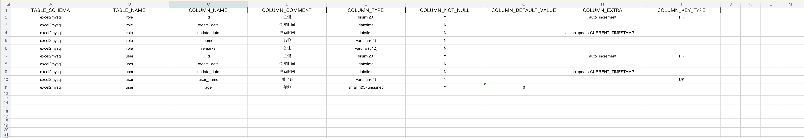

# mysql2excel

    通过db.properties导出excel小工具
    
## 功能

+ 通过数据源导出表结构到xls xlsx
+ 支持导出单列索引类型: PK/UK/PK&UK
+ 支持简单筛选指定table(支持正则)
    

## 使用准备

### 数据源:  db.properties (参考)
    datasource.url: jdbc:mysql://localhost:3306/mysql2excel?serverTimezone=GMT%2B8&allowPublicKeyRetrieval=true&useUnicode=true&characterEncoding=UTF-8&useSSL=false
    datasource.username: root
    datasource.password: 123456
    datasource.driver-class-name: com.mysql.cj.jdbc.Driver
      
### 测试相关:

#### mysql2excel.sql

---
   + [/src/test/resources/mysql2excel.sql](src/test/resources/mysql2excel.sql)
---

#### 导出效果 (以实际为准)



## 命令

```
# 打包
mvn -DskipTests package

# 查看帮助
java -jar mysql2excel-1.0.0-SNAPSHOT.jar --help

# 导出xls (非文件全名)
java -jar mysql2excel-1.0.0-SNAPSHOT.jar -data-source ../src/test/resources/db.properties -file-name test -excel-type xls

# 导出xls
java -jar mysql2excel-1.0.0-SNAPSHOT.jar -data-source ../src/test/resources/db.properties -file-name test.xls -excel-type xls

# 导出xlsx
java -jar mysql2excel-1.0.0-SNAPSHOT.jar -data-source ../src/test/resources/db.properties -file-name test.xlsx -excel-type xlsx

# 导出xls (指定路径)
java -jar mysql2excel-1.0.0-SNAPSHOT.jar -data-source ../src/test/resources/db.properties -out-path out -file-name test.xls -excel-type xls 

# 导出xls (指定table - user, 即只导出user) 
java -jar mysql2excel-1.0.0-SNAPSHOT.jar -data-source ../src/test/resources/db.properties -file-name test.xls -excel-type xls -filter-table user 

# 导出xls (指定多个table - user role, 即只导出user role) 
java -jar mysql2excel-1.0.0-SNAPSHOT.jar -data-source ../src/test/resources/db.properties -file-name ../src/test/resources/test.xls -excel-type xls -filter-table "user role" 

# 导出xls (排除table - user, 即导出非user外的) 
java -jar mysql2excel-1.0.0-SNAPSHOT.jar -data-source ../src/test/resources/db.properties -file-name ../src/test/resources/test.xls -excel-type xls -filter-table user -exclude 
```


### 其他

```

### COLUMN EXTRA ###

auto_increment                      自增
on update CURRENT_TIMESTAMP         根据当前时间戳更新

### COLUMN KEY TYPE ###

PK          主键
UK          唯一键
PK&UK       既是主键又是唯一键, e.g: code列: PK(name, code), UK(code)
```

